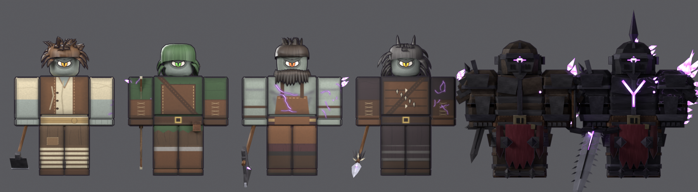
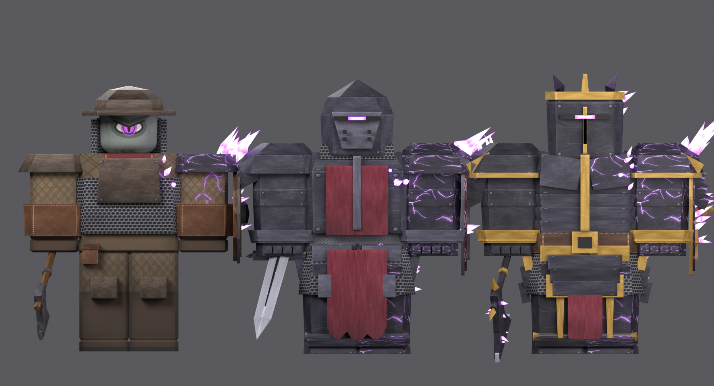
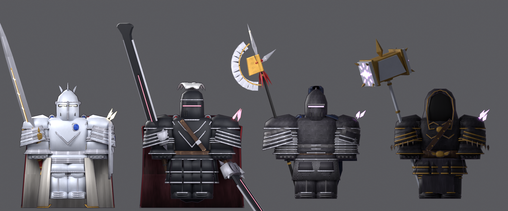
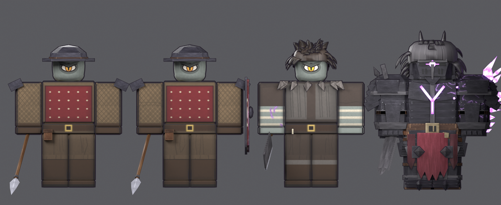
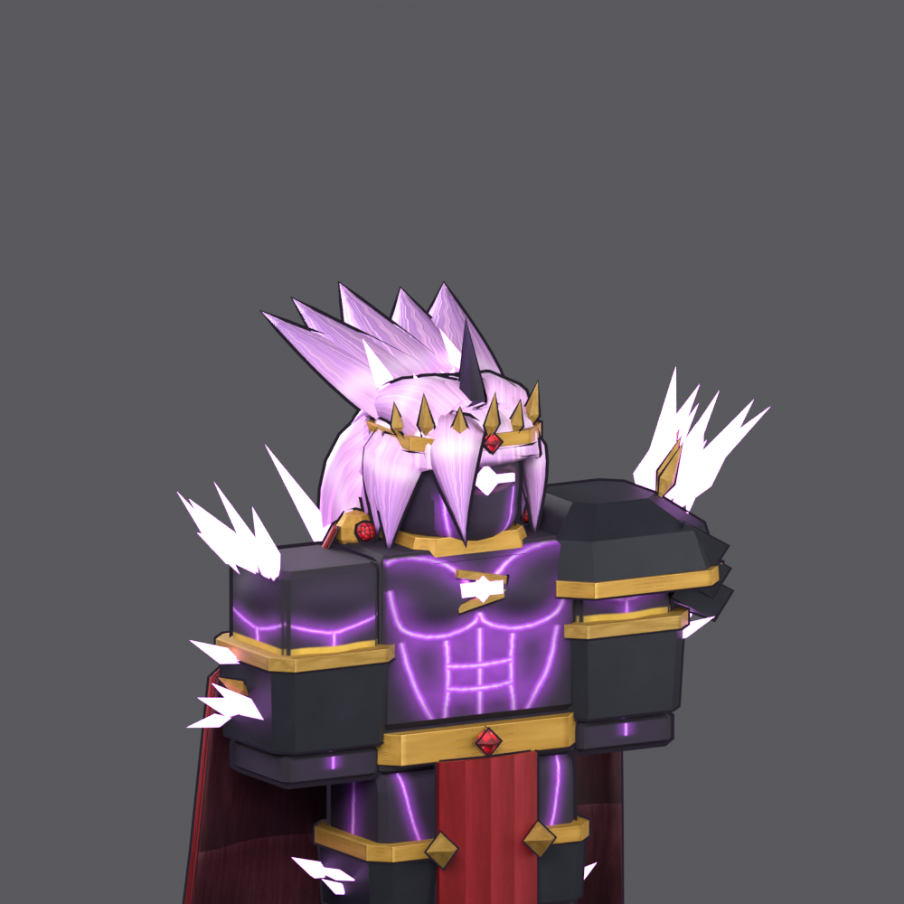
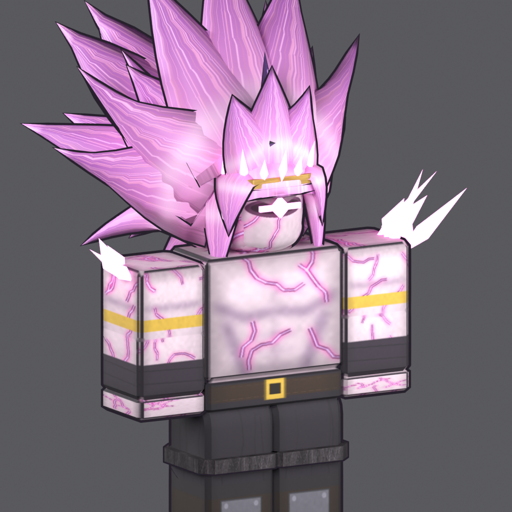
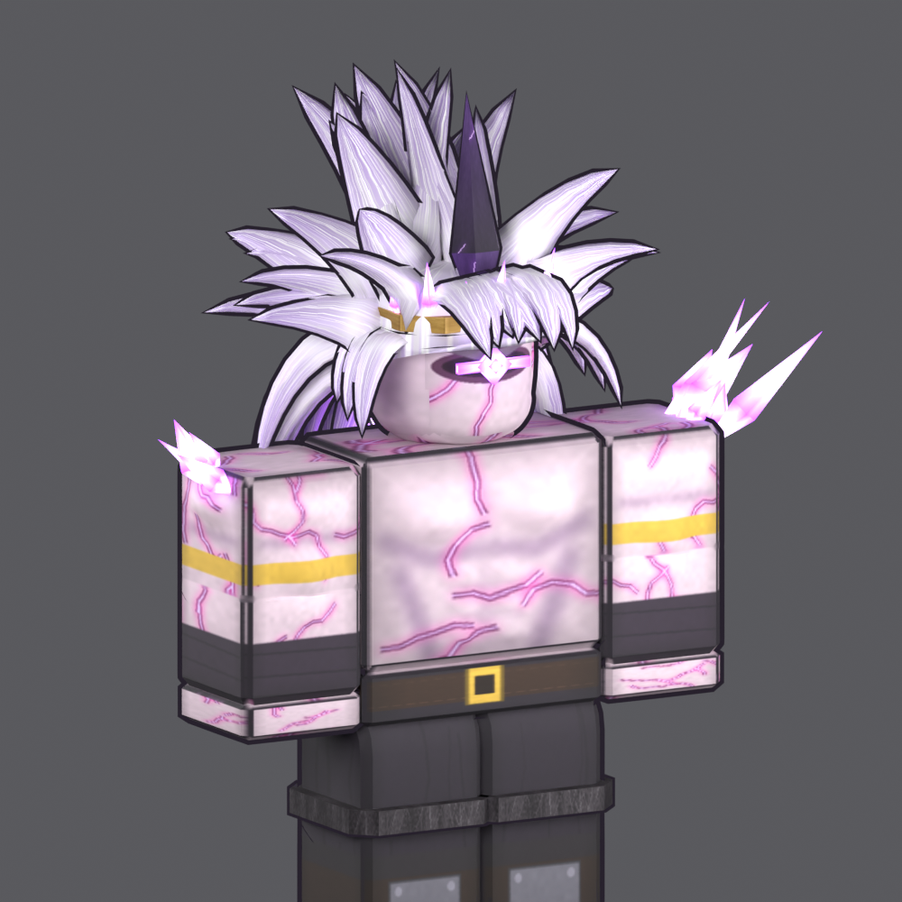
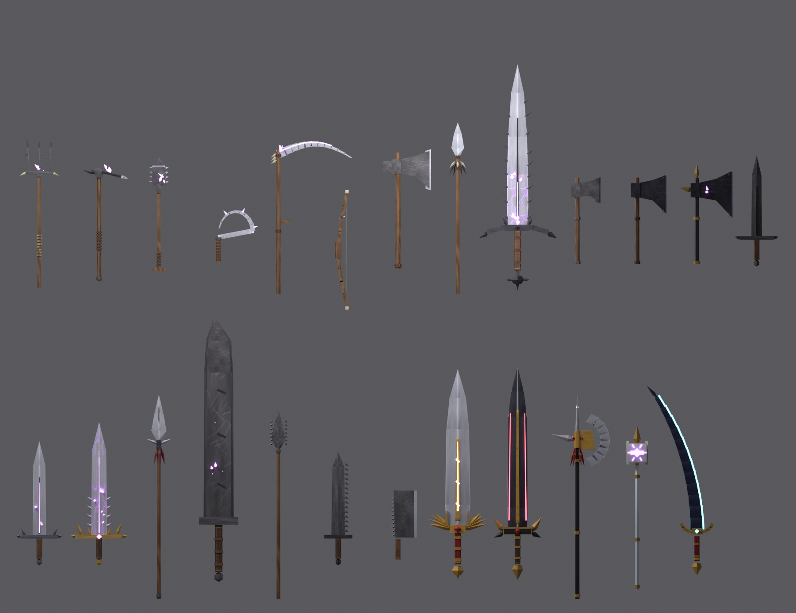
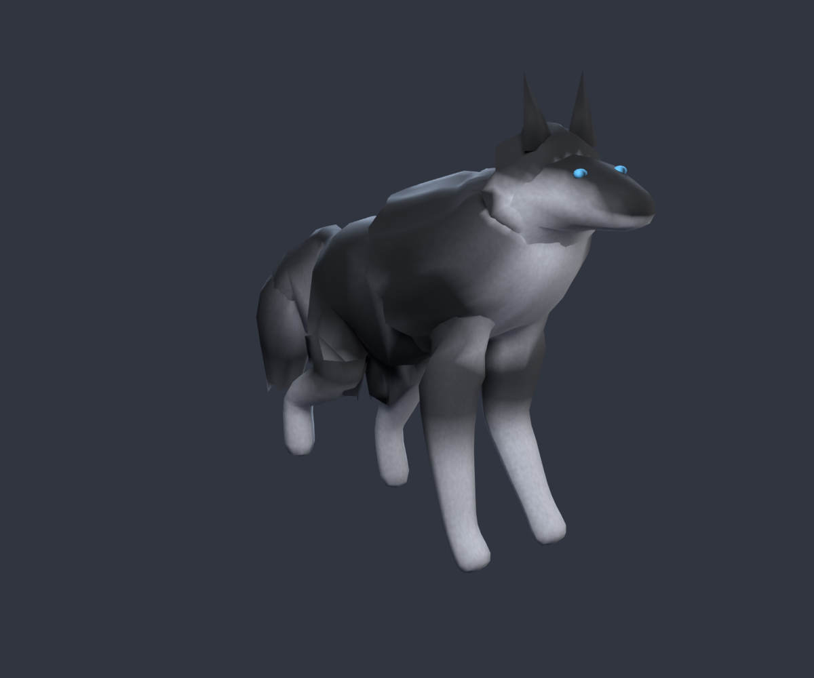

# Corrupted Cyclops Roster (Roblox R15)

ตัวละครไซคลอปส์ที่ติด corrupted ทั้งหมด ไล่ระดับตามด่าน สร้างด้วยโค้ด (Blender `bpy`)
ร่างคือ **mesh R15 จริงจาก Roblox Studio** (`reference/roblox_r15.obj`) ชุด หน้า และกล้ามวาดลง texture
แล้ว bake ลง UV ของ R15 ส่วนผม เกราะ และคริสตัลเป็นชิ้นแยก ทุกชิ้นมีเส้นขอบอนิเมะ (`_Outline`)
build ด้วย `python3 cyclops/roster2.py` (ไฟล์อยู่ที่ `export/r15/`)











## รายชื่อ

| กลุ่ม | ชุด (`CyclopsOutfit`) | อาวุธแนะนำ (`CyclopsWeapon`) |
|---|---|---|
| ด่าน 1 | `Villager` ชาวบ้าน | `Hoe` / `Spade` / `Sickle` / `Scythe` / `Pitchfork` |
| ด่าน 1 | `Hunter` นายพราน | `HunterBow` |
| ด่าน 1 | `Woodcutter` ไซคลอปส์ตัดไม้ | `WoodcutterAxe` |
| ด่าน 1 | `WolfRider` ไซคลอปส์ขี่หมาป่า | `WolfRiderSpear` |
| ด่าน 1 | `WolfHandler` ชาวบ้านคุมหมาป่า | `SerratedCleaver` (ฟันเลื่อย) |
| ด่าน 1 | `KnightApprentice` อัศวินฝึกหัด | `ApprenticeSword` / `ApprenticeAxe` + โล่ |
| ด่าน 1 (Elite) | `EliteOneHorn` One-Horn | `OneHornGreatsword` |
| ด่าน 2 | `KnightApprenticeInfected` อัศวินฝึกหัด (ติดหนัก) | `ApprenticeSword` / `ApprenticeAxe` + โล่ |
| ด่าน 2 | `KnightMid` อัศวินชั้นกลาง | `MidSword` / `MidAxe` + โล่ |
| ด่าน 2 | `KnightHigh` อัศวินชั้นสูง | `HighSword` / `HighAxe` + โล่ |
| ด่าน 2 | `WolfKnight` อัศวินหมาป่า | `SerratedSword` หรือ `SerratedSpear` (ฟันเลื่อย) |
| กองทัพ | `Spearman` พลหอก | `Spear` |
| กองทัพ | `SpearmanShield` พลหอกโล่ | `Spear` + `CyclopsShield = true` (โล่ทาวเวอร์) |
| ราชสำนัก | `KnightWhite` อัศวินขาว (เกราะขาวทอง หมวกปีก ผ้าคลุมแดง) | `RadiantGreatsword` + `CyclopsShield = true` (โล่ขาวทองฝังทับทิม) |
| ราชสำนัก | `KnightBlack` อัศวินดำ (เกราะดำทอง หมวกเขาแหลม ผ้าคลุมแดง) | `AbyssGreatsword` (ถือคู่ สองมือ) |
| ราชสำนัก | `KnightRoyalGuard` ราชองครักษ์ (แทนขุนนาง) | `RoyalHalberd` |
| ราชสำนัก | `KnightPaladin` อัศวินศักดิ์สิทธิ์แห่งดวงตา (แทนบาทหลวง มีวงรัศมี) | `EyeWarhammer` |
| ราชสำนัก | `General` นายพล | `DragonSlayer` (ดาบมหึมา) |
| รองบอส | `CyclopsPrince` เจ้าชายไซคลอปส์ (ผิวกรมท่า รอยร้าวฟ้าเรือง ตาที่อก มงกุฎ) | `EclipseSaber` |
| บอส | `CyclopsKing` ราชา (กล้ามวาด) | มือเปล่า |
| บอส | `CyclopsKing3D` ราชา (ซิกแพ็กและอกนูนเป็น 3D จริง) | มือเปล่า |

**อาวุธฟันเลื่อย** (`Serrated*`) ทำให้ติดสถานะเลือดไหล: เสียเลือด 3 ทุก 0.5 วินาที นาน 4 วินาที
ระหว่างนั้น Humanoid จะมี attribute `Bleeding = true` (ปรับค่าได้ที่ `Kit.BLEED_*`)

**ถือดาบคู่:** อาวุธที่มี `dual = true` (`AbyssGreatsword`) จะมีอีกเล่มที่มือซ้ายตอนถืออยู่
ฟันพร้อมกันและทำดาเมจเท่ากัน

**ผม:** ทุกตัวมีผม mesh ของตัวเอง (กระจุกใหญ่ ซ้อนเป็นชั้นแบบอนิเมะ) ราชามีผมทรงซูเปอร์ไซย่าสีชมพู
ถ้าอยากใช้ผมที่ซื้อใน catalog แทน ใส่ attribute
`CyclopsAccessories = "<asset id>"` บน NPC ระบบจะโหลดผมมาใส่ ย้อมสีให้เข้ากับตัว และซ่อนผมของชุดให้เอง
(ไม่ใส่ mesh ผมลงในไฟล์ของเรา เพราะสิทธิ์ที่ได้จากการซื้อคือสิทธิ์สวมใส่ ไม่ใช่สิทธิ์แจกจ่าย mesh)

**อัศวินแต่ละระดับใช้อาวุธได้ 3 แบบ:** ขวาน ดาบ หรือดาบกับโล่
(ตั้ง `CyclopsShield = true` เพื่อใส่โล่ ฝึกหัดได้โล่กลมไม้ ชั้นกลางได้โล่ทรงหยดน้ำ ชั้นสูงได้โล่ kite ขอบทองที่มีคริสตัล)

**หมาป่า** (`Wolf` = หมาป่าธรรมดา/ลูกกระจ๊อก, `AlphaWolf` = จ่าฝูง ใหญ่กว่า 1.45 เท่า):
ตัวเป็นชิ้นเดียวผิวเรียบ มี **rig กระดูกจริง** 21 ชิ้น พร้อมแอนิเมชัน `Idle` และ `Walk`
สร้างด้วย `wolf_rig.py` และตั้งใจไม่ให้เห็นร่องรอย corrupted

- Import `export/creatures/Wolf.fbx` (Import 3D แล้วให้เป็น rig)
- เอา Model ที่ได้ไปวางใน `CyclopsAssets/Creatures/Wolf`
- แอนิเมชัน: เปิด Animation Editor ที่ตัวหมาป่า ▸ Import ▸ From FBX Animation
  ▸ เลือก `Wolf_Idle.fbx` / `Wolf_Walk.fbx` แล้ว Publish

## ตั้งค่าใน Roblox Studio (ครั้งเดียว)

1. **Import โมเดล** (Home ▸ Import 3D) แล้วจัดลงโฟลเดอร์แบบนี้ใน **ReplicatedStorage**:
   ```
   ReplicatedStorage
   ├─ CyclopsData            (ModuleScript ← roblox/CyclopsData.lua)
   └─ CyclopsAssets          (Folder)
      ├─ Outfits/Villager/…  (MeshPart ทุกชิ้นจาก export/outfits/Villager.fbx)
      ├─ Weapons/MidSword/…  (จาก export/weapons/MidSword.fbx)
      └─ Creatures/Wolf/…    (จาก export/creatures/Wolf.fbx)
   ```
   ชื่อโฟลเดอร์ย่อยต้องตรงกับชื่อไฟล์ ไม่ต้อง import ทุกตัว เอาเฉพาะที่จะใช้ก็ได้
2. ใส่ **ServerScriptService**:
   - `CyclopsKit` เป็น **ModuleScript** วางโค้ดจาก `roblox/CyclopsKit.lua`
   - `CyclopsSpawner` เป็น **Script** วางโค้ดจาก `roblox/CyclopsSpawner.server.lua`

## วาง NPC ในด่าน

- **ไซคลอปส์:** สร้าง R15 Block Rig (Avatar ▸ Rig Builder) แล้วใส่ Attributes:
  `CyclopsOutfit = "KnightMid"`, `CyclopsWeapon = "MidSword"`, `CyclopsShield = true`
- **หมาป่า:** วาง Part ไว้เป็นจุดเกิด แล้วใส่ Attribute `CyclopsCreature = "AlphaWolf"`
  ตอนเริ่มเกม Part นั้นจะถูกแทนด้วยหมาป่า
- **บอส:** ใช้ `CyclopsOutfit = "CyclopsKing"` แล้วขยายร่างใน Humanoid
  (เช่น BodyHeightScale/BodyWidthScale/BodyDepthScale = 1.6) ชุดจะขยายตามให้เอง

ถ้าจะเขียนสคริปต์เอง ใช้ `Kit.dress(model, name, {shield = true})`, `Kit.equip(model, weapon)`,
`Kit.spawnCreature(name, cframe)` และ NPC ฟันได้ด้วย `tool:Activate()`
(พวกไซคลอปส์จะไม่ทำดาเมจกันเอง)

**ข้อควรรู้:**
- ถ้าโมเดลทั้งหมดหันกลับหลัง ให้ตั้ง `Kit.FLIP_180 = true` ใน CyclopsKit
- ถ้าธนูหรืออาวุธชี้ผิดทิศตอนถือ ให้แก้ค่า `grip` ของอาวุธนั้นใน `weapons.py` แล้ว build ใหม่
  หรือปรับ `Tool.Grip` ใน Studio ตรง ๆ

## Texture

ใช้ภาพ 1024×1024 ภาพเดียวร่วมกันทุกตัว (`export/cyclops_texture.png`) ฝังอยู่ในทุก FBX แล้ว
ในภาพมีวัสดุ 36 แบบ:
- เหล็กมีหมุด / เหล็กแตกเรืองแสง / สนิม / ทอง
- หนัง / ผ้าหลายสี / เกราะโซ่ / ผ้าบุนวม
- ผิวไซคลอปส์ 3 ระดับ (ปกติ / แตก / ราชา) ผม ตา
- ขน ไม้ เหล็กดิบ โล่ และกระดูก

## Build ใหม่

```
pip install bpy==4.2.0 pillow
python3 cyclops/build_all.py            # เพิ่ม --no-render ถ้าไม่ต้องการภาพ
```

| ไฟล์ | หน้าที่ |
|---|---|
| `texture_gen.py` | วาด texture |
| `kit.py` | เครื่องมือเรขาคณิต, UV, export |
| `outfits/` | ชุดแต่ละตัว (`stage1`, `knights`, `elite`, `king`, ส่วนประกอบร่วมใน `common`) |
| `weapons.py` | อาวุธ |
| `wolf_rig.py` | หมาป่าแบบมี rig + แอนิเมชัน (`--alpha` สำหรับจ่าฝูง) |
| `build_all.py` | สร้าง FBX, `CyclopsData.lua` และภาพ preview |

อยากเพิ่มตัวใหม่ ให้เขียนฟังก์ชันคืนค่า `Outfit` แล้วเพิ่มเข้า `groups` ใน `build_all.py`
