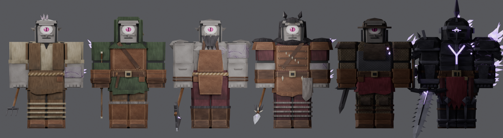
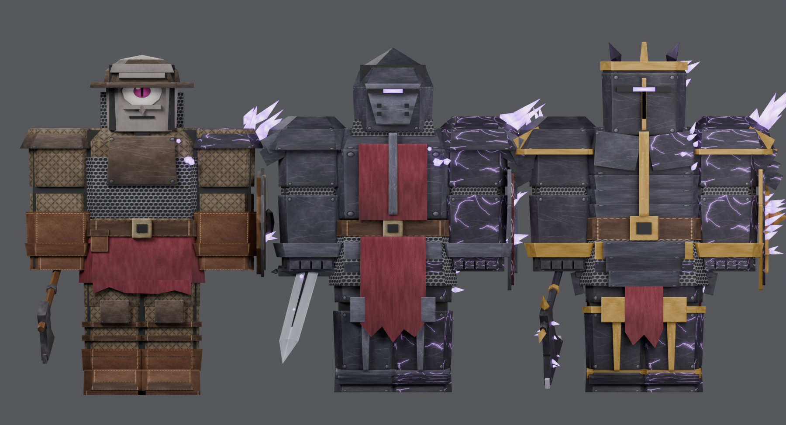
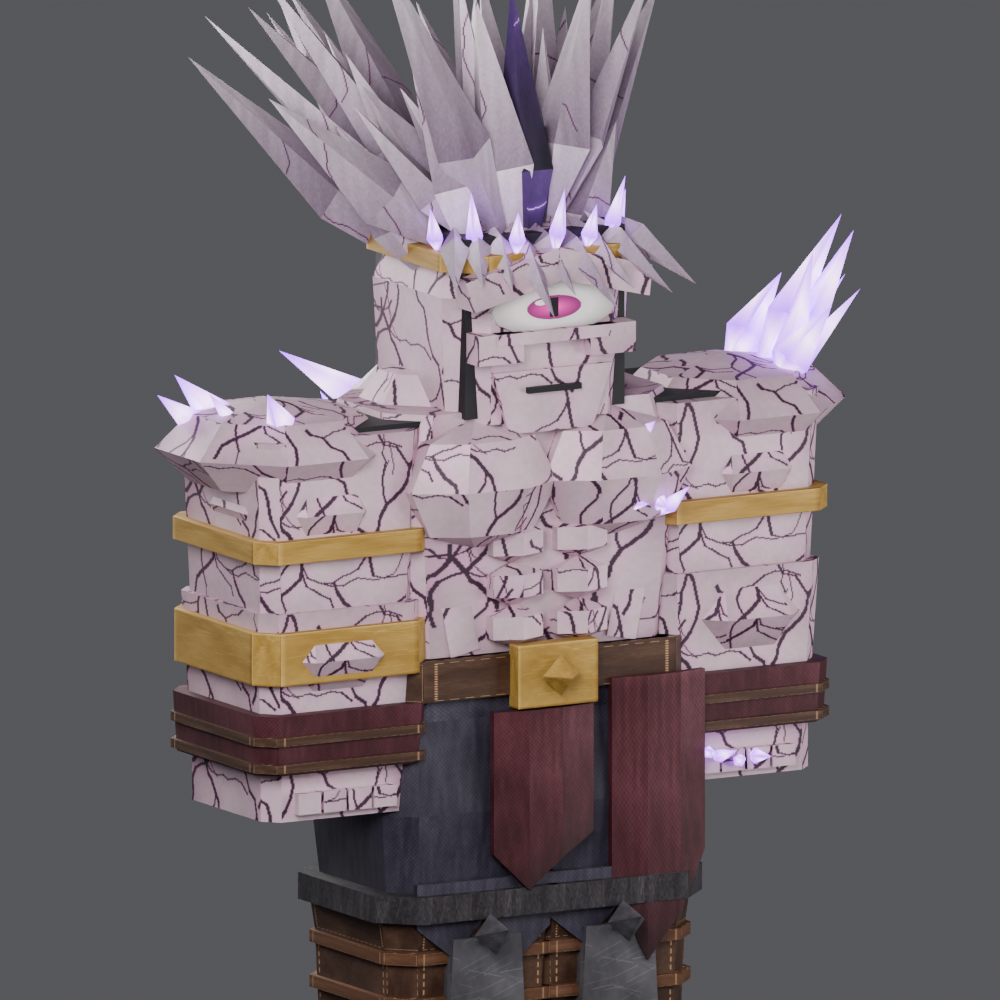
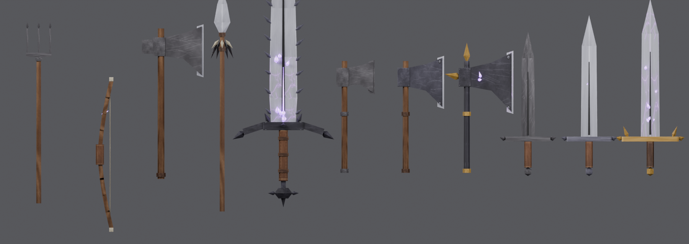
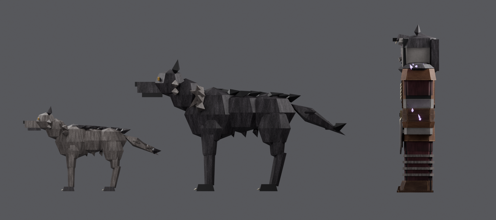

# Corrupted Cyclops Roster (Roblox R15)

ตัวละครไซคลอปส์ที่ติด corrupted ทั้งหมด ไล่ระดับตามด่าน สร้างด้วยโค้ด (Blender `bpy`)
ทุกชุดพอดีกับ **R15 Block rig** และ**ไม่ใช้ armature** แต่ละชิ้นจะถูก weld เข้ากับส่วนร่างกาย R15 ที่ชื่อตรงกัน







## รายชื่อ

| ด่าน | ชุด (`CyclopsOutfit`) | อาวุธแนะนำ (`CyclopsWeapon`) | Corruption |
|---|---|---|---|
| 1 | `Villager` ชาวบ้าน | `Pitchfork` | 15% |
| 1 | `Hunter` นายพราน | `HunterBow` | 20% |
| 1 | `Woodcutter` ไซคลอปส์ตัดไม้ | `WoodcutterAxe` | 30% |
| 1 | `WolfRider` ไซคลอปส์ขี่หมาป่า | `WolfRiderSpear` | 35% |
| 1 | `KnightApprentice` อัศวินฝึกหัด | `ApprenticeSword` / `ApprenticeAxe` + โล่ | 30% |
| 1 (Elite) | `EliteOneHorn` One-Horn | `OneHornGreatsword` | 50% |
| 2 | `KnightApprenticeInfected` อัศวินฝึกหัด (ติดหนักขึ้น) | `ApprenticeSword` / `ApprenticeAxe` + โล่ | 55% |
| 2 | `KnightMid` อัศวินชั้นกลาง | `MidSword` / `MidAxe` + โล่ | 65% |
| 2 | `KnightHigh` อัศวินชั้นสูง | `HighSword` / `HighAxe` + โล่ | 90% |
| บอส | `CyclopsKing` ราชาไซคลอปส์เขาเดียว | ใช้มือเปล่า | 100% (แสงชมพูม่วง) |

**อัศวินแต่ละระดับใช้อาวุธได้ 3 แบบ:** ขวาน ดาบ หรือดาบกับโล่
(ตั้ง `CyclopsShield = true` เพื่อใส่โล่ ฝึกหัดได้โล่กลมไม้ ชั้นกลางได้โล่ทรงหยดน้ำ ชั้นสูงได้โล่ kite ขอบทองที่มีคริสตัล)

**หมาป่า** (`Wolf` = หมาป่าธรรมดา/ลูกกระจ๊อก, `AlphaWolf` = จ่าฝูง ตัวใหญ่พอให้ขี่):
ตั้งใจไม่ให้เห็นร่องรอย corrupted เลย แบ่งเป็นชิ้น ตัว หัว หาง และขาบน/ล่าง × 4
`CyclopsKit` จะสร้าง Motor6D ให้อัตโนมัติ เลยใช้ Animation Editor ทำแอนิเมชันต่อได้ทันที

## ตั้งค่าใน Roblox Studio (ครั้งเดียว)

1. **Import โมเดล** (Home ▸ Import 3D) แล้วจัดลงโฟลเดอร์แบบนี้ใน **ReplicatedStorage**:
   ```
   ReplicatedStorage
   ├─ CyclopsData            (ModuleScript ← roblox/CyclopsData.lua)
   └─ CyclopsAssets          (Folder)
      ├─ Outfits/Villager/…  (MeshPart ทุกชิ้นจาก export/outfits/Villager.fbx)
      ├─ Weapons/MidSword/…  (จาก export/weapons/MidSword.fbx)
      └─ Creatures/Wolf/…    (จาก export/creatures/Wolf.fbx)
   ```
   ชื่อโฟลเดอร์ย่อยต้องตรงกับชื่อไฟล์ ไม่ต้อง import ทุกตัว เอาเฉพาะที่จะใช้ก็ได้
2. ใส่ **ServerScriptService**:
   - `CyclopsKit` เป็น **ModuleScript** วางโค้ดจาก `roblox/CyclopsKit.lua`
   - `CyclopsSpawner` เป็น **Script** วางโค้ดจาก `roblox/CyclopsSpawner.server.lua`

## วาง NPC ในด่าน

- **ไซคลอปส์:** สร้าง R15 Block Rig (Avatar ▸ Rig Builder) แล้วใส่ Attributes:
  `CyclopsOutfit = "KnightMid"`, `CyclopsWeapon = "MidSword"`, `CyclopsShield = true`
- **หมาป่า:** วาง Part ไว้เป็นจุดเกิด แล้วใส่ Attribute `CyclopsCreature = "AlphaWolf"`
  ตอนเริ่มเกม Part นั้นจะถูกแทนด้วยหมาป่า
- **บอส:** ใช้ `CyclopsOutfit = "CyclopsKing"` แล้วขยายร่างใน Humanoid
  (เช่น BodyHeightScale/BodyWidthScale/BodyDepthScale = 1.6) ชุดจะขยายตามให้เอง

ถ้าจะเขียนสคริปต์เอง ใช้ `Kit.dress(model, name, {shield = true})`, `Kit.equip(model, weapon)`,
`Kit.spawnCreature(name, cframe)` และ NPC ฟันได้ด้วย `tool:Activate()`
(พวกไซคลอปส์จะไม่ทำดาเมจกันเอง)

**ข้อควรรู้:**
- ถ้าโมเดลทั้งหมดหันกลับหลัง ให้ตั้ง `Kit.FLIP_180 = true` ใน CyclopsKit
- ถ้าธนูหรืออาวุธชี้ผิดทิศตอนถือ ให้แก้ค่า `grip` ของอาวุธนั้นใน `weapons.py` แล้ว build ใหม่
  หรือปรับ `Tool.Grip` ใน Studio ตรง ๆ

## Texture

ใช้ภาพ 1024×1024 ภาพเดียวร่วมกันทุกตัว (`export/cyclops_texture.png`) ฝังอยู่ในทุก FBX แล้ว
ในภาพมีวัสดุ 36 แบบ:
- เหล็กมีหมุด / เหล็กแตกเรืองแสง / สนิม / ทอง
- หนัง / ผ้าหลายสี / เกราะโซ่ / ผ้าบุนวม
- ผิวไซคลอปส์ 3 ระดับ (ปกติ / แตก / ราชา) ผม ตา
- ขน ไม้ เหล็กดิบ โล่ และกระดูก

## Build ใหม่

```
pip install bpy==4.2.0 pillow
python3 cyclops/build_all.py            # เพิ่ม --no-render ถ้าไม่ต้องการภาพ
```

| ไฟล์ | หน้าที่ |
|---|---|
| `texture_gen.py` | วาด texture |
| `kit.py` | เครื่องมือเรขาคณิต, UV, export |
| `outfits/` | ชุดแต่ละตัว (`stage1`, `knights`, `elite`, `king`, ส่วนประกอบร่วมใน `common`) |
| `weapons.py` | อาวุธ |
| `creatures.py` | หมาป่า |
| `build_all.py` | สร้าง FBX, `CyclopsData.lua` และภาพ preview |

อยากเพิ่มตัวใหม่ ให้เขียนฟังก์ชันคืนค่า `Outfit` แล้วเพิ่มเข้า `groups` ใน `build_all.py`
