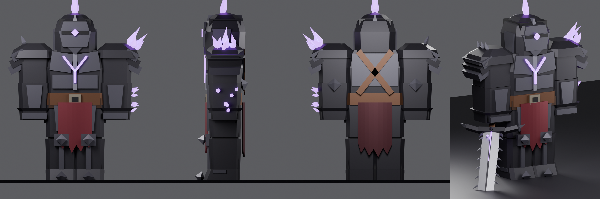
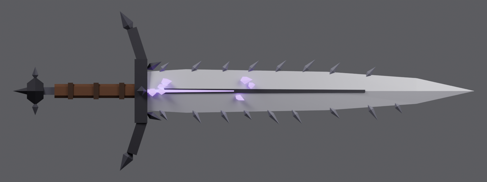

# One-Horn Cyclops (Roblox R15)

เกราะ low-poly ของตัวละคร One-Horn Cyclops สร้างให้พอดีกับ **R15 Block rig** ทุกส่วน
**ไม่มี armature**: แต่ละชิ้นผูกกับส่วนร่างกาย R15 ชื่อเดียวกันด้วย weld จึงขยับตามแอนิเมชัน R15 ปกติ




## ชิ้นส่วน

ไฟล์ `export/onehorn_armor.fbx` มี MeshPart 20 ชิ้น ตั้งชื่อตามส่วนร่างกาย R15:

- `<ส่วน>_Armor` เกราะ หนัง และผ้า ทั้ง 15 ส่วน
  (Head, UpperTorso, LowerTorso, Left/Right UpperArm, LowerArm, Hand, UpperLeg, LowerLeg, Foot)
- `<ส่วน>_Glow` ส่วนเรืองแสงสีม่วง ได้แก่ ตาเดียวและเขา (Head), ตัว V กลางอก (UpperTorso),
  คริสตัลที่ไหล่ แขน และมือซ้าย

สีทั้งหมดมาจาก texture เล็ก ๆ ภาพเดียว (`onehorn_palette.png`) ที่ฝังอยู่ใน FBX แล้ว
ส่วน `_Glow` สคริปต์จะเปลี่ยนเป็น Material Neon สีม่วงให้อัตโนมัติ

ดาบ `export/onehorn_greatsword.fbx` (Lightly Corrupted Greatsword) มีชิ้น `Handle`, `Blade`, `Guard`, `Pommel`, `Blade_Glow`

## ใส่เกราะใน Roblox Studio

1. **Import**: Home ▸ Import 3D ▸ เลือก `onehorn_armor.fbx`
   (ถ้าหน้าต่าง import มีตัวเลือก Scale Unit ให้เลือก **Stud** หรือเลือกอะไรก็ได้ เพราะสคริปต์จะปรับขนาดให้เอง)
2. ใน **ReplicatedStorage** สร้าง Folder ชื่อ **`OneHornArmor`** แล้วย้าย MeshPart ทั้ง 20 ชิ้นเข้าไป
3. ใน **ServerScriptService** สร้าง Script แล้ววางโค้ดจาก `roblox/OneHornArmor.server.lua`
4. กด **Play** ผู้เล่นทุกคนจะเกิดมาในชุด One-Horn Cyclops

**ถ้าอยากดูบนหุ่นโดยไม่ต้องกด Play ค้าง:** Avatar ▸ Rig Builder ▸ R15 ▸ Block Rig
แล้วเปลี่ยนชื่อหุ่นใน Workspace เป็น `OneHornCyclops` สคริปต์จะใส่เกราะให้หุ่นนี้ด้วยตอนกด Play/Run

ตั้งค่าได้ที่หัวสคริปต์:

| ค่า | ใช้ทำอะไร |
|---|---|
| `APPLY_TO_PLAYERS` | `false` = ใส่ให้แค่หุ่น preview |
| `FLIP_180` | ตั้งเป็น `true` ถ้าเกราะหันกลับหลัง |
| `STRIP_AVATAR` | ถอดหมวก ผม เสื้อ และหน้าของผู้เล่นออกก่อนใส่เกราะ |
| `GLOW_COLOR` / `BODY_COLOR` | สีเรืองแสง / สีร่างกายใต้เกราะ |

ถ้าร่างกายไม่ใช่ Block (เช่น body package อื่น) เกราะจะยืดตามขนาดของแต่ละส่วนให้อัตโนมัติ
แต่จะพอดีเป๊ะที่สุดกับ Block rig

## ดาบ

1. Import `onehorn_greatsword.fbx`
2. สร้าง `Tool` ใน `StarterPack` แล้วย้ายทั้ง 5 ชิ้นเข้าไป (ชิ้นด้ามชื่อ `Handle` อยู่แล้ว)
3. ใส่ Script ใน Tool แล้ววางโค้ดจาก `roblox/GreatswordScript.server.lua`
   (ดาเมจ 35 คูลดาวน์ 1 วินาที สคริปต์ปรับขนาดดาบให้ด้ามยาว 1.3 stud)
4. ถ้าดาบชี้ผิดทิศตอนถือ ให้ปรับค่า `Grip` ของ Tool

## สร้างใหม่ / แก้ไข

```
pip install bpy==4.2.0 pillow
python3 onehorn/build_onehorn.py
```

สคริปต์สร้าง FBX, ภาพ render และ `OneHornArmor.server.lua` ใหม่ทั้งหมด
(ตารางขนาดและตำแหน่งในสคริปต์ Luau ถูกคำนวณจากโมเดล ห้ามแก้ด้วยมือ ให้แก้ที่ `OneHornArmor.template.lua` แทน)
