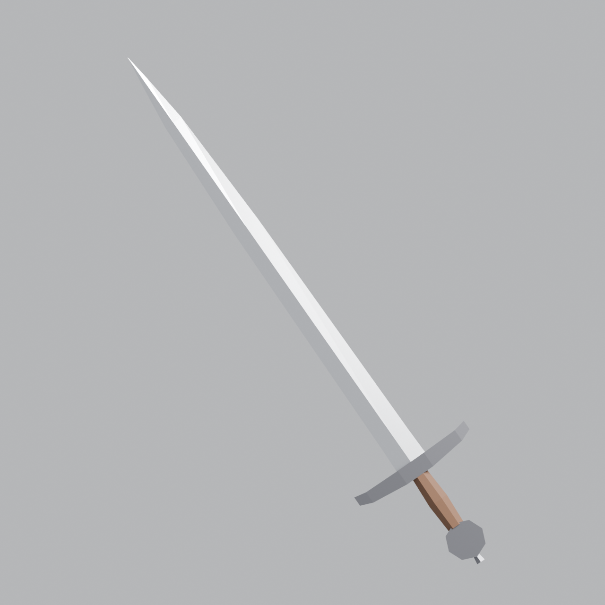
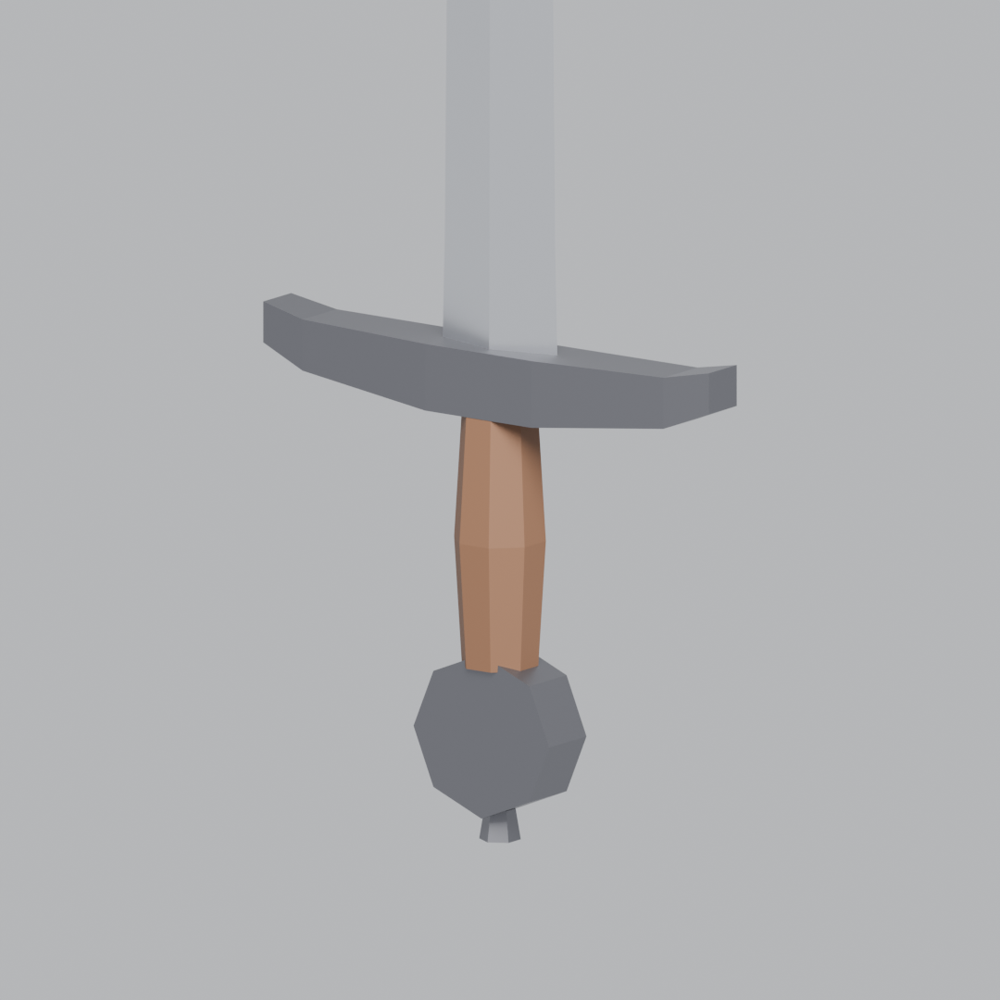

# ดาบยุคกลาง Low-Poly (Arming Sword)

ดาบมือเดียวแบบยุโรปยุคกลาง ทั้งเล่มมี 79 หน้า (faces) แบ่งเป็น 4 ชิ้น:

| ชิ้น | วัสดุ |
|---|---|
| `Blade` ใบดาบ หน้าตัดรูปข้าวหลามตัด | Steel |
| `Guard` การ์ดกันมือ | DarkIron |
| `Grip` ด้ามจับ 8 เหลี่ยม | Leather |
| `Pommel` ปุ่มท้ายด้ามทรงล้อ | DarkIron |

ความยาวรวมประมาณ 0.95 เมตร

## UV และ texture

ทุกชิ้นมี UV แยกกันอยู่ใน texture ภาพเดียว ใบดาบอยู่ซ้ายบน การ์ดอยู่ขวาบน ด้ามอยู่ซ้ายล่าง และปุ่มท้ายด้ามอยู่ขวาล่าง
อยากเปลี่ยนสีก็แค่ระบายสีทับในช่องของชิ้นนั้นใน `sword_texture.png` แล้วอัปโหลดใหม่

## ไฟล์

- `export/medieval_sword.fbx` ใช้กับ Roblox Studio, Unity, Unreal
- `export/medieval_sword.glb` ใช้กับเว็บหรือ Godot
- `export/medieval_sword.obj` + `.mtl` ใช้ได้กับโปรแกรม 3D ทั่วไป
- `export/medieval_sword.blend` เปิดแก้ใน Blender
- `export/sword_texture.png` texture สี 256×256 (ฝังอยู่ใน FBX/GLB แล้ว)
- `roblox/SwordScript.server.lua` สคริปต์ให้ดาบฟันได้ใน Roblox
- `build_sword.py` สคริปต์ที่สร้างทุกอย่างข้างบน รันใหม่ด้วยคำสั่ง
  `pip install bpy==4.2.0 && python3 sword/build_sword.py`

## นำเข้า Roblox Studio

1. **Import**: แท็บ Home ▸ Import 3D ▸ เลือก `medieval_sword.fbx` ▸ Import
   จะได้ Model ที่มี MeshPart 4 ชิ้น
2. **สร้าง Tool**: คลิกขวาที่ `StarterPack` ▸ Insert Object ▸ `Tool` แล้วตั้งชื่อ `MedievalSword`
3. **ย้ายชิ้นส่วน**: ลาก MeshPart ทั้ง 4 ชิ้นเข้าไปใน Tool แล้วลบ Model ที่ว่างแล้วทิ้ง
4. **ตั้งด้ามจับ**: เปลี่ยนชื่อ `Grip` เป็น **`Handle`** (Roblox ใช้ชิ้นชื่อนี้เป็นจุดที่มือจับ)
5. **ใส่สคริปต์**: Insert `Script` เข้าไปใน Tool แล้ววางโค้ดจาก `roblox/SwordScript.server.lua`
6. **สี**: ทุกชิ้นมี UV และ texture ฝังอยู่ใน FBX แล้ว สีควรขึ้นเองหลัง import
   ถ้าสีไม่ขึ้น ให้อัปโหลด `sword_texture.png` (Asset Manager ▸ Import ▸ Images)
   แล้วนำ ID ของรูปไปใส่ใน `TextureID` ของ MeshPart ทั้ง 4 ชิ้น
7. กด **Play** แล้วคลิกเพื่อฟัน (ค่าเริ่มต้น: ดาเมจ 20, คูลดาวน์ 0.6 วินาที แก้ได้ที่หัวสคริปต์)

**ถ้าดาบชี้ผิดทิศตอนถือ** ให้แก้ที่ Tool ▸ `Grip` (เช่น หมุน `GripForward` / `GripUp`)
หรือใช้ปลั๊กอิน *Tool Grip Editor* ช่วยจัด
**ถ้าขนาดเล็กหรือใหญ่ไป** เลือกทั้ง 4 ชิ้นแล้วใช้ Scale ปรับพร้อมกัน
